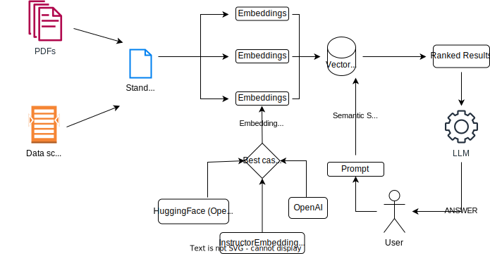

# An experiment to serve user queries regarding the Arizona Water Innovation Initiative

A chatbot developed using LangChain framework for LLms for the Arizona Water Innovation Initiative as a prototype

Additional tasks to do:
 

  1. Develop GUI/ Web-based UI for users
  2. Compare performance and use-cases of different embeddings and LLMs
  3. Get more data for the bot

## An overview diagram:
 

